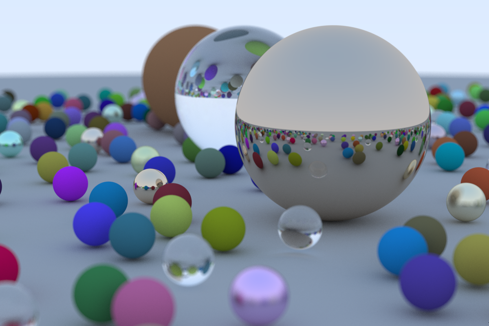

# Rokonio's Ray Tracer in (more than) one weekend

My implementation in rust of the Peter Shirley's [Ray Tracing in One Weekend](https://raytracing.github.io/books/RayTracingInOneWeekend.html).

Book's render:

My custom scene:

